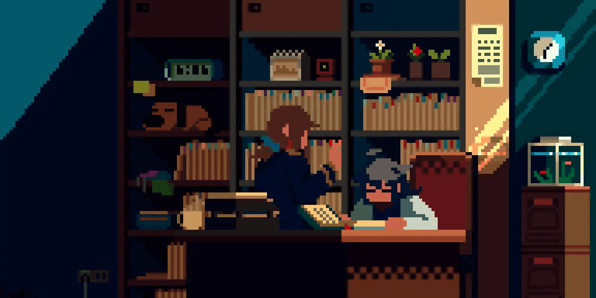
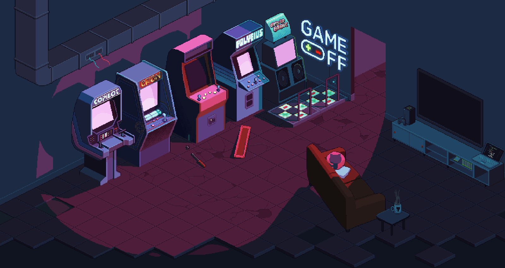

<!-- Perfil de Arthur Rodrigues Quintanilha -->

# Olá, eu sou o Arthur 👋

**Desenvolvedor full stack em formação • Goiânia, GO**

Crio aplicações web, APIs e experiências que resolvem problemas reais. Atualmente estudo **Análise e Desenvolvimento de Sistemas na FATESG SENAI**.

  
  
  

---

<table>
<tr>
<td width="65%" valign="top">

<h3>Um pouco sobre mim</h3>

Comecei a programar aos 17 anos. Gosto de construir o produto inteiro: da interface e das regras de negócio ao banco de dados e ao deploy.

<ul>
  <li>🔭 <b>Hoje:</b> construindo a Solenne, uma plataforma de álbuns colaborativos para eventos.</li>
  <li>🌱 <b>Estudando:</b> Java, arquitetura de software, segurança e infraestrutura na AWS.</li>
  <li>🧩 <b>Interesses:</b> SaaS, dashboards, autenticação, APIs e boas experiências para quem usa o produto.</li>
  <li>🐧 <b>Ambiente:</b> Arch Linux, VS Code, Cursor, Git e Docker.</li>
</ul>

</td>
<td width="35%" align="center" valign="middle">

</td>
</tr>
</table>

## Projetos em destaque

| Projeto | O que estou construindo | Tecnologias |
| :--- | :--- | :--- |
| **[Solenne](https://solenne.capture.app.br/)** | Álbum colaborativo para eventos: convidados enviam fotos por QR Code ou link, enquanto o organizador gerencia galeria, permissões e moderação. **[Acessar o site ↗](https://solenne.capture.app.br/)** | React, TypeScript, NestJS, PostgreSQL, Prisma, Docker, AWS |
| **LifeQuest** | Aplicação de organização pessoal com hábitos, metas e gamificação. Repositório privado. | React, TypeScript, NestJS, Prisma, PostgreSQL |
| **Devlingo** | Plataforma de aprendizado de programação com trilhas, lições e elementos de gamificação. Repositório privado. | React, NestJS, Prisma, PostgreSQL |

## Tecnologias que uso

**Interface e linguagens** 

**APIs e dados** 

**Ferramentas e infraestrutura** 

## O que gosto de colocar em prática

`APIs REST` · `Autenticação JWT` · `Controle de acesso` · `Modelagem relacional` · `Migrations` · `Interfaces responsivas` · `Integração front-end / back-end` · `Deploy`

<b>Mais sobre meu processo de desenvolvimento</b>

 

Costumo organizar o trabalho em etapas: entender o problema, planejar a interface e as regras, desenvolver em branches, revisar as alterações e testar antes do deploy. Na Solenne, também trabalho com uploads, controle de permissões, infraestrutura e segurança da aplicação.

---

### Vamos nos conectar?

  
  
  
  
  

  

Construindo, aprendendo e melhorando um projeto de cada vez.

